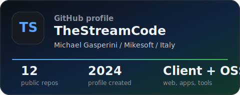
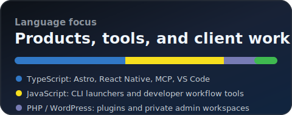

<!-- GitHub profile README for TheStreamCode -->

  

  
  

  
  
  
  
  
  

<h2 align="center">I build fast, maintainable digital products for businesses.</h2>

  I am Michael Gasperini, founder of <a href="https://mikesoft.it"><strong>Mikesoft</strong></a>, a web design and development studio based in Italy.
  I work with companies, professionals, and founders who need websites, apps, e-commerce, SEO foundations, and practical digital tools with clear ownership and direct communication.

  <strong>Client work first.</strong> Open source and developer tools along the way.

---

## What I Build

<table>
  <tr>
    <td width="50%">
      <h3>Business Websites</h3>
      
Fast, responsive, SEO-ready websites built with clean structure, strong messaging, and long-term maintainability.

    </td>
    <td width="50%">
      <h3>E-commerce Experiences</h3>
      
Online stores and checkout flows focused on clarity, trust, secure payments, and smoother conversion paths.

    </td>
  </tr>
  <tr>
    <td width="50%">
      <h3>Mobile Apps</h3>
      
Practical mobile products for Android and cross-platform use cases, with attention to privacy, UX, and performance.

    </td>
    <td width="50%">
      <h3>Automation & Internal Tools</h3>
      
Lightweight tools, dashboards, and AI-assisted workflows that remove repetitive work and make operations easier.

    </td>
  </tr>
  <tr>
    <td width="50%">
      <h3>WordPress & CMS Tools</h3>
      
Custom plugins, private workspaces, content systems, and admin tools for teams that need control without complexity.

    </td>
    <td width="50%">
      <h3>Technical SEO & Performance</h3>
      
Site architecture, Core Web Vitals, metadata, structured data, accessibility foundations, and clean launch setup.

    </td>
  </tr>
</table>

---

## Selected Work

<table>
  <tr>
    <td width="33%">
      <h3><a href="https://mikesoft.it">Mikesoft</a></h3>
      
Bilingual studio website built with Astro, TypeScript, SCSS, server output on Vercel, technical SEO, localized routes, blog, contact API, and privacy-aware foundations.

      
<strong>Astro / TypeScript / SCSS / Vercel</strong>

    </td>
    <td width="33%">
      <h3><a href="https://easypiva.vercel.app">EasyPIVA</a></h3>
      
Open-source fiscal planning web app for Italian freelancers and small businesses, with local browser calculations and PDF export.

      
<strong>TypeScript / Vite / Playwright</strong>

    </td>
    <td width="33%">
      <h3><a href="https://play.google.com/store/apps/details?id=it.mikesoft.keysoft">Keysoft</a></h3>
      
Offline-first Android password manager with local encrypted vault data, biometric authentication, and no backend dependency for vault storage.

      
<strong>Expo / React Native / TypeScript</strong>

    </td>
  </tr>
  <tr>
    <td width="33%">
      <h3><a href="https://wordpress.org/plugins/mikesoft-teamvault/">Mikesoft TeamVault</a></h3>
      
WordPress plugin for private document management inside the admin area, with protected storage, access control, previews, ZIP export, and activity logs.

      
<strong>PHP / WordPress / Security</strong>

    </td>
    <td width="33%">
      <h3><a href="https://github.com/TheStreamCode/discord-management-mcp">Discord Management MCP</a></h3>
      
Safe-by-default MCP server for Discord management, with JSON backups, restore planning, guarded mutations, and local stdio transport.

      
<strong>TypeScript / Node.js / MCP</strong>

    </td>
    <td width="33%">
      <h3><a href="https://marketplace.visualstudio.com/items?itemName=mikesoft.chutes-usage-vscode">Chutes Usage Monitor</a></h3>
      
VS Code extension for monitoring Chutes usage, rolling limits, quotas, and plan status directly from the editor.

      
<strong>TypeScript / VS Code API</strong>

    </td>
  </tr>
</table>

  

---

## Open Source & Developer Tools

I publish practical tools when I see repeated friction in my own workflow or client work. Most of them are small, focused, privacy-aware, and built to solve a specific problem well.

| Project | What it does | Stack |
| --- | --- | --- |
| [Codex CLI Launcher](https://github.com/TheStreamCode/codex-cli-launcher) | Unofficial VS Code extension that opens OpenAI Codex CLI in a side terminal. | JavaScript, VS Code |
| [GitHub Copilot CLI Launcher](https://github.com/TheStreamCode/github-copilot-cli-launcher) | Unofficial VS Code extension for launching GitHub Copilot CLI from the editor toolbar. | JavaScript, VS Code |
| [Kilo CLI Launcher](https://github.com/TheStreamCode/vscode-kilo-cli-launcher) | Unofficial VS Code extension that opens Kilo CLI beside the active editor. | JavaScript, VS Code |
| [Antigravity CLI Launcher](https://github.com/TheStreamCode/antigravity-cli-launcher) | Unofficial VS Code launcher for Antigravity CLI with cross-platform support. | JavaScript, VS Code |
| [Grok Build Launcher](https://github.com/TheStreamCode/grok-build-launcher) | Unofficial VS Code launcher for Grok Build CLI from the editor toolbar. | JavaScript, VS Code |
| [Agentic R&D Skill](https://github.com/TheStreamCode/agentic-rd-skill) | Structured workflow for agent-assisted research, product, business, and technical planning. | JavaScript, Agent Skills |

---

## Support Open Source

I maintain practical open-source tools around developer workflows, VS Code extensions, WordPress operations, local-first apps, and AI-assisted work. If these projects save you time or help your work, you can support continued maintenance through [GitHub Sponsors](https://github.com/sponsors/TheStreamCode).

## Tech Stack

  
  
  
  
  
  
  
  
  
  
  
  
  

---

## How I Work

- Clear scope before implementation.
- Direct communication from strategy to launch.
- Code, domain, content, and direction stay owned by the client.
- Performance, SEO, privacy, and accessibility foundations are part of the build.
- Open-source habits: documentation, versioning, issue discipline, testing, and maintainable handoff.

---

## GitHub Snapshot

  
  

---

  <strong>Need a website, app, e-commerce project, or custom digital tool?</strong>

  

  <a href="https://mikesoft.it">Website</a> /
  <a href="mailto:info@mikesoft.it">Email</a> /
  <a href="https://www.facebook.com/mikesoft.web">Facebook</a> /
  <a href="https://www.instagram.com/mikesoft.it">Instagram</a> /
  <a href="https://www.youtube.com/@mikesoft_webdesign">YouTube</a> /
  <a href="https://www.linkedin.com/in/mikesoft-web-design">LinkedIn</a> /
  <a href="https://github.com/TheStreamCode">GitHub</a>

