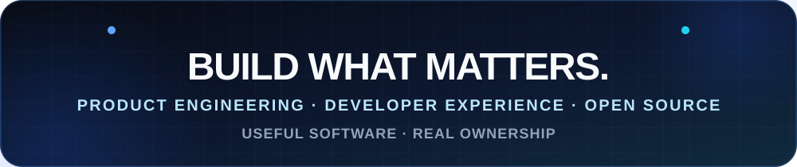

<!-- GitHub profile README for TheStreamCode. -->

  

  

<h1 align="center">Michael Gasperini</h1>

  <strong>Independent Software Engineer · Open-Source Builder · Founder of <a href="https://mikesoft.it">Mikesoft</a></strong>

  I turn complex workflows into useful, maintainable software — from digital products for businesses to tools used by developers.

  Italy · Remote worldwide · Italian &amp; English

  
  
  
  

---

## One practice, three kinds of work

For more than ten years, I have worked across design, development, and delivery. The formats change; the standard does not: understand the real problem, make the experience clear, and leave people in control of what was built.

<table>
  <tr>
    <td width="33%" valign="top">
      <strong>01 · Product engineering</strong>  
      Websites, e-commerce, web and mobile apps, internal tools, and integrations designed around measurable business needs.
    </td>
    <td width="33%" valign="top">
      <strong>02 · Developer experience</strong>  
      VS Code extensions, CLI applications, MCP servers, AI workflows, and automation that remove repeated friction.
    </td>
    <td width="33%" valign="top">
      <strong>03 · Open source</strong>  
      Original projects and focused upstream contributions, built with practical documentation, testing, and safe defaults.
    </td>
  </tr>
</table>

Through [Mikesoft](https://mikesoft.it/en/), I work directly with companies, founders, and professionals from first idea to launch. Through [TheStreamCode](https://github.com/TheStreamCode), I publish the tools, experiments, and engineering work that can be useful beyond a single project.

## Selected work

<table>
  <tr>
    <td width="50%" valign="top">
      DEVELOPER EXPERIENCE
      <h3><a href="https://github.com/TheStreamCode/super-cli">Super CLI ↗</a></h3>
      
A cross-platform VS Code extension that brings coding-agent CLIs into one focused sidebar.

      
<code>TypeScript</code> <code>VS Code</code> <code>Cross-platform</code>

      
<a href="https://marketplace.visualstudio.com/items?itemName=mikesoft.vscode-super-cli">Marketplace</a>

    </td>
    <td width="50%" valign="top">
      APPLIED AI
      <h3><a href="https://github.com/TheStreamCode/chutes-build">Chutes Build ↗</a></h3>
      
A privacy-first, open-source coding agent designed for transparent, local developer workflows.

      
<code>Rust</code> <code>Terminal UI</code> <code>AI tooling</code>

      
<a href="https://chutes.ai">Chutes ecosystem</a>

    </td>
  </tr>
  <tr>
    <td width="50%" valign="top">
      LOCAL-FIRST MOBILE
      <h3><a href="https://github.com/TheStreamCode/keysoft">Keysoft ↗</a></h3>
      
An offline Android password manager with local encryption, biometric unlock, and no vault backend.

      
<code>React Native</code> <code>Expo</code> <code>TypeScript</code>

      
<a href="https://play.google.com/store/apps/details?id=it.mikesoft.keysoft">Google Play</a>

    </td>
    <td width="50%" valign="top">
      BUSINESS SOFTWARE
      <h3><a href="https://github.com/TheStreamCode/mikesoft-teamvault">Mikesoft TeamVault ↗</a></h3>
      
Private document management for WordPress with protected storage, access control, export, and activity logs.

      
<code>PHP</code> <code>WordPress</code> <code>Access control</code>

      
<a href="https://wordpress.org/plugins/mikesoft-teamvault/">WordPress.org</a>

    </td>
  </tr>
</table>

  <a href="https://github.com/TheStreamCode?tab=repositories"><strong>Explore every public project →</strong></a>

## Open source, both ways

I build my own tools, and I contribute focused fixes and integrations to projects I use and respect — including [Cline](https://github.com/cline/cline), [Hermes Agent](https://github.com/NousResearch/hermes-agent), [Vendure](https://github.com/vendurehq/vendure), and [models.dev](https://github.com/anomalyco/models.dev).

That upstream work keeps my engineering grounded in real codebases: review discipline, backward compatibility, cross-platform behavior, security boundaries, and maintainable tests.

## How I work

- **Problem before platform** — the technology follows the job, not the other way around.
- **Ownership by default** — clear handover, portable data, and no artificial lock-in.
- **Safe, explicit behavior** — especially around credentials, local files, permissions, and destructive actions.
- **From direction to delivery** — strategy, UX, implementation, verification, launch, and documentation belong to the same product story.

## Toolbox

  
  
  
  
  
  
  
  
  
  
  

## GitHub activity

  <picture>
    <source media="(prefers-color-scheme: dark)" srcset="https://raw.githubusercontent.com/TheStreamCode/TheStreamCode/profile-stats/profile/activity-dark.svg" />
    <source media="(prefers-color-scheme: light), (prefers-color-scheme: no-preference)" srcset="https://raw.githubusercontent.com/TheStreamCode/TheStreamCode/profile-stats/profile/activity-light.svg" />
    
  </picture>

Updated daily from GitHub's official API.

## Let's build something useful

I'm available for selected freelance projects, product and technical consulting, open-source collaboration, and remote engineering opportunities. If you value clear communication, maintainable software, and real product ownership, [tell me what you are working on](mailto:info@mikesoft.it).

  <a href="https://mikesoft.it/en/"><strong>Client work at Mikesoft</strong></a>
  &nbsp;·&nbsp;
  <a href="mailto:info@mikesoft.it"><strong>Start a conversation</strong></a>
  &nbsp;·&nbsp;
  <a href="https://github.com/sponsors/TheStreamCode"><strong>Support open source</strong></a>

---

  <strong>Useful software starts with a real problem.</strong>

